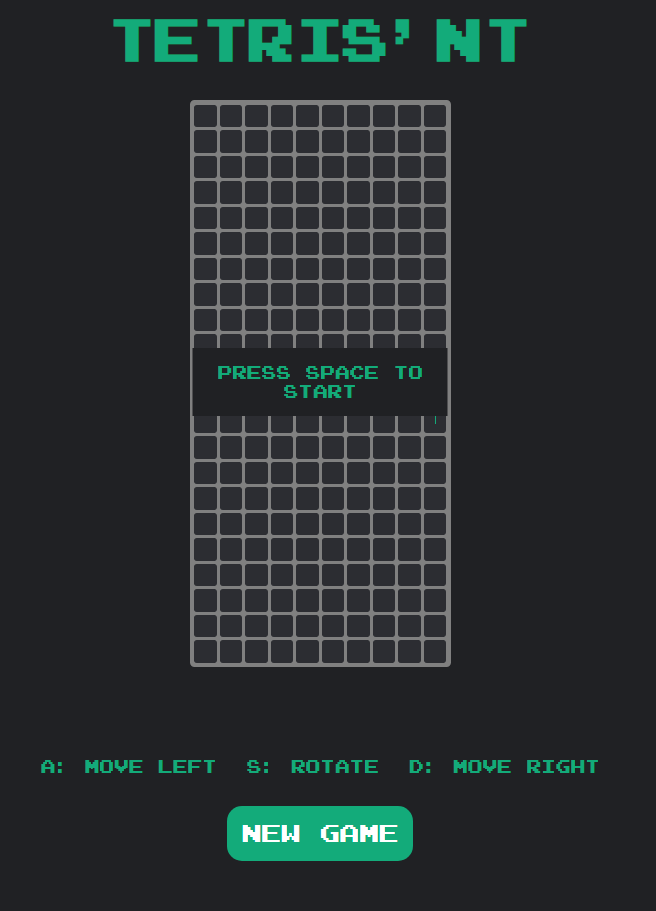
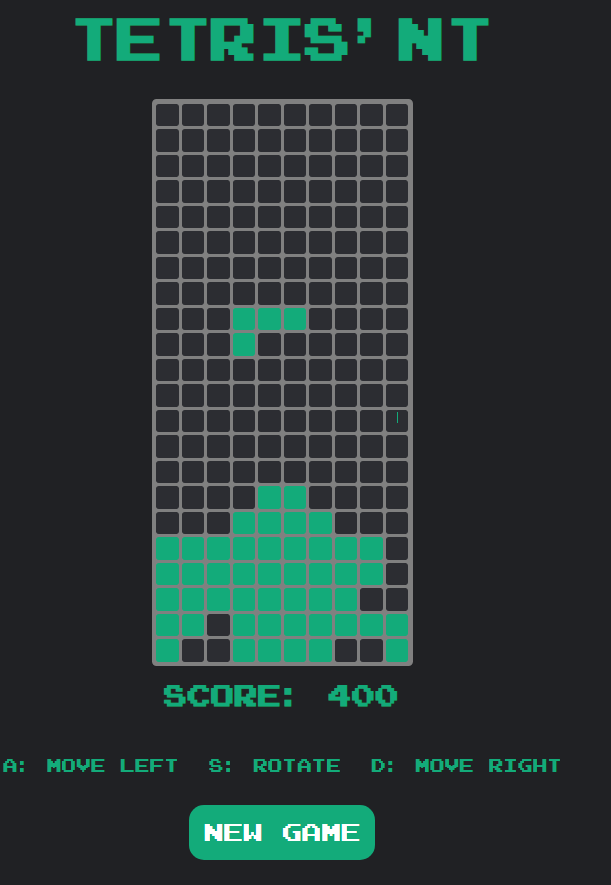
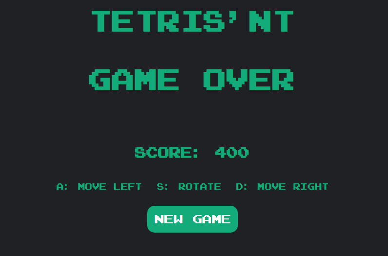

# 

### By mattser
 

About
=====
Web based JavaScript Video Game Challenge! Welcome to my original concept, with no relation to the original classic, hit arcade game, Tetris!
This Repo is for educational purposes only.

This project has been written in:
* HTML
* CSS (SCSS)
* JavaScript

 

Features
========

* Randomly Generated Tetrominos
* Translating Tetrominos (Left and Right)
* Rotating Tetrominos
* Row Deletion and Point System
* Object Oriented Approach

 

Known Bugs
==========

* Rotating near map boundries may bork the game
* If rotation is called at the same time as the game steps, blocks will fly
* If rotation is called at a merge event it may bork the game

 

Credits
=======
Font generated from [cufonfonts](https://www.cufonfonts.com/font/arcade), (c)1997-2003 Yuji Adachi

 

Screenshots
===========

*Pre Game State*

*Game*

*Game Over*

